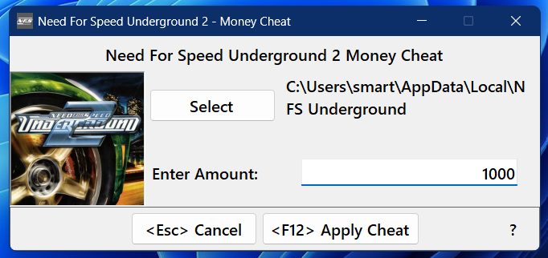

# 💸NFSU2-Money-Cheat
A lightweight Windows utility that lets you modify your in-game bank balance in *Need For Speed: Underground 2*. Select your save file, enter the desired amount, and instantly update your funds—no hex editing, no fuss.

---

## 🛠 Features

- 🔍 Browse and select your NFSU2 save file (`*.sav`)
- 💰 Instantly overwrite your in-game bank balance with any value
- 🧼 Minimal UI, no installation required
- 🔐 No telemetry, no internet access—runs entirely offline. Free to fork and modify
- 🕵️ No Spyware. No Ads. No Malware.

---

## 📦 How to Use

1. Launch `NFSU2-Money-Cheat.exe`
2. Click **Select** and select your save file (The app automatically tries to locate the closest possible path to your save file when you click Select)
3. Enter your desired bank amount
4. Click **Apply Cheat** to patch the save file

> ⚠️ Your save file will automatically be backed up before any edits are made.

---

## 🖥 Compatibility

- ✅ Tested on **Windows 11**
- ❓ Other platforms and OS versions are **untested**

---

## 📥 Download

Grab the latest release from the [Releases](https://github.com/aryaanlambe/NFSU2-Money-Cheat/releases) page.

---

## 🧠 Notes

- Windows SmartScreen may warn about unknown publishers—this is expected for unsigned binaries.
- This tool modifies game data. Use responsibly and at your own discretion.

---

## 🗣 Feedback & Issues

Found a bug or have a feature request? Open an [Issue](https://github.com/aryaanlambe/NFSU2-Money-Cheat/issues) or start a discussion. Contributions welcome.

---

---

Built for players who value control, speed, and simplicity.
